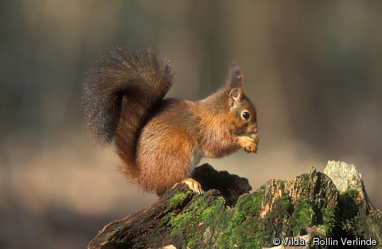

# Modelos de ocupación con el paquete `unmarked`

En este ejemplo se modela la ocupación por un especie de ardilla (*Sciurus vulgaris*) en Suiza.



Este ejemplo se basa en Pp. 590-600 del Capítulo 10 libro Kéry y Royle (2016). Además de traducirlo al español, hice algunos cambios menores en el código.

Para este ejemplo se emplea la función `occ` del paquete [**unmarked**](https://cran.r-project.org/web/packages/unmarked/index.html).

# --------------------
# Modelo jerárquico:

El proceso ecológico, en este caso la ocupación, se modela como: 

${z_i} \tilde {} Bernoulli(\psi)$

Mientras que el proceso observacional, en este caso la detección, se modela como: 

${y_i{_j}} {|} {z_i} \tilde {} Bernoulli({z_i}p)$

# --------------------------
## Cargar paquetes:

```{r, message=FALSE, warning=FALSE}
library(unmarked)
library(raster)
library(rgdal)
#library(AICcmodavg)
```

# ----------------------------------
## PASO 1: Leer datos y preparar covariables

```{r}
data <- read.table("SwissSquirrels.txt", header=TRUE)
head(data); tail(data)
names(data)
str(data)
```

Tabla 1. Datos de los muestreos de la ardilla en 265 sitios de muestreo, y covariables medidas. Aquí Solo se muestran los primeros 20 datos.

```{r, echo=FALSE, results='asis'}
knitr::kable(head(data,20))
```

```{r fig.width=6, fig.height=6, fig.align='center'}
# datos de presencia/ausencia
y <- as.matrix(data[,7:9]); head(y); tail(y)

# valores originales de las covariables sin estandarizar
elev.orig <- data[,"ele"]; head(elev.orig); tail(elev.orig)

forest.orig <- data[,"forest"]; head(forest.orig); tail(forest.orig)

time <- matrix(as.character(1:3), nrow=265, ncol=3, byrow=T); head(time); tail(time)

date.orig <- as.matrix(data[,10:12]); head(date.orig); tail(date.orig)

dur.orig <- as.matrix(data[,13:15]);head(dur.orig); tail(dur.orig)

# histogramas
covs <- cbind(elev.orig, forest.orig, date.orig, dur.orig);head(covs); tail(covs)

par(mfrow=c(2,2))
for(i in 1:8){
  hist(covs[,i], breaks=50, col="grey", main=colnames(covs)[i])
}
pairs(cbind(elev.orig, forest.orig, date.orig, dur.orig))
```

# -------------------------------------------
## PASO 2: estandarización de covariables

```{r}
(means <- c(apply(cbind(elev.orig, forest.orig), 2, mean), 
            date.orig=mean(c(date.orig), na.rm=TRUE), 
            dur.orig=mean(c(dur.orig), na.rm=TRUE)))

(sds <- c(apply(cbind(elev.orig, forest.orig), 2, sd), 
          date.orig=sd(c(date.orig), na.rm=TRUE), 
          dur.orig=sd(c(dur.orig), na.rm=TRUE)))

elev <- (elev.orig-means[1])/sds[1]; head(elev); tail(elev)

forest <- (forest.orig-means[2])/sds[2]; head(forest); tail(forest)

date <- (date.orig-means[3])/sds[3]; head(date); tail(date)

date[is.na(date)] <- 0; head(date); tail(date)

dur <- (dur.orig-means[4])/sds[4]; head(dur); tail(dur)

dur[is.na(dur)] <- 0; head(dur); tail(dur)
```

# ------------------------------------------
## PASO 3: procesar con `unmarked`

```{r}
umf <- unmarkedFrameOccu(y=y, 
        siteCovs=data.frame(elev=elev, forest=forest), 
        obsCovs=list(time=time, date=date, dur=dur))
summary(umf)

# Modelos para la probabilidad de detección p(covariables) y psi(.)
summary(fm1 <- occu(~1 ~1, data=umf))
summary(fm2 <- occu(~date ~1, data=umf))
summary(fm3 <- occu(~date + I(date^2) ~1, data=umf))
summary(fm4 <- occu(~date + I(date^2) + I(date^3) ~1, data=umf))
summary(fm5 <- occu(~dur ~1, data=umf))
summary(fm6 <- occu(~date + dur ~1, data=umf))
summary(fm7 <- occu(~date + I(date^2) + dur ~1, data=umf))
summary(fm8 <- occu(~date + I(date^2) + I(date^3)+dur ~1, data=umf))
summary(fm9 <- occu(~dur + I(dur^2) ~1, data=umf))
summary(fm10 <- occu(~date + dur + I(dur^2) ~1, data=umf))
summary(fm11 <- occu(~date + I(date^2) + dur+I(dur^2) ~1, data=umf))
summary(fm12 <- occu(~date + I(date^2) + I(date^3) + dur + I(dur^2) ~1, data=umf))

# para ordenar modelos de acuerdo al AIC más bajo a mayor
fms <- fitList("p(.)psi(.)"                         = fm1,
               "p(date)psi(.)"                      = fm2,
               "p(date+date2)psi(.)"                = fm3,
               "p(date+date2+date3)psi(.)"          = fm4,
               "p(dur)psi(.)"                       = fm5,
               "p(date+dur)psi(.)"                  = fm6,
               "p(date+date2+dur)psi(.)"            = fm7,
               "p(date+date2+date3+dur)psi(.)"      = fm8,
               "p(dur+dur2)psi(.)"                  = fm9,
               "p(date+dur+dur2)psi(.)"             = fm10,
               "p(date+date2+dur+dur2)psi(.)"       = fm11,
               "p(date+date2+date3+dur+dur2)psi(.)" = fm12)

(ms <- modSel(fms))

cbind(fm1@AIC,fm2@AIC,fm3@AIC,fm4@AIC,fm5@AIC,fm6@AIC,fm7@AIC,fm8@AIC,fm9@AIC,fm10@AIC,fm11@AIC,fm12@AIC) # mejor modelo 6 

# modelos psi(covariable) y p(mejor modelo)
summary(fm13 <- occu(~date + dur + I(dur^2) ~elev, data=umf))
summary(fm14 <- occu(~date + dur + I(dur^2) ~elev + I(elev^2), data=umf))
summary(fm15 <- occu(~date + dur + I(dur^2) ~elev + I(elev^2) +  I(elev^3), data=umf))
cbind(fm13@AIC, fm14@AIC, fm15@AIC) # model 14 with elev2 best

# Check effects of forest and interactions
summary(fm16 <- occu(~date + dur + I(dur^2) ~elev + I(elev^2) + forest, data=umf))
summary(fm17 <- occu(~date + dur + I(dur^2) ~elev + I(elev^2) + forest + I(forest^2), data=umf))
summary(fm18 <- occu(~date + dur +I(dur^2) ~elev+I(elev^2)+forest+I(forest^2)+elev:forest, data=umf))
summary(fm19 <- occu(~date+dur+I(dur^2) ~elev+I(elev^2)+forest+I(forest^2)+elev:forest+elev:I(forest^2), data=umf))
summary(fm20 <- occu(~date+dur+I(dur^2) ~elev+I(elev^2)+forest+I(forest^2)+elev:forest+elev:I(forest^2)+I(elev^2):forest, data=umf))
summary(fm21 <- occu(~date+dur+I(dur^2) ~elev+I(elev^2)+forest+I(forest^2)+elev:forest+elev:I(forest^2)+I(elev^2):forest+ I(elev^2):I(forest^2), data=umf))

cbind(fm16@AIC, fm17@AIC, fm18@AIC, fm19@AIC, fm20@AIC) # fm20 es el mejor

# -----------------------------
# OJO: modelo fm16
# para ver coeficientes 
fm16[1]@estimates[1] #intercepto
fm16[1]@estimates[2] #elev
fm16[1]@estimates[3] #forest

# para linearizar psi y p
# para linearizar psi y p en modelos sencillos
fm1
backTransform(fm1, "state") # ocupación
backTransform(fm1, "det") # detección

# para linearizar psi y p en modelos más complejos
fm16
backTransform(linearComb(fm16, coefficients=c(1,0,0,0), type="state"))
backTransform(linearComb(fm16, coefficients=c(1,0,0,0), type="det"))
```

# ----------------------------------------
## PASO 5: para graficar 

```{r fig.width=6, fig.height=6, fig.align='center'}
# se crean primero nuevas covariables estandarizadas
orig.elev <- seq(200, 2500,,100)    
orig.forest <- seq(0, 100,,100)
orig.date <- seq(15, 110,,100)
orig.duration <- seq(100, 550,,100)
# estandarizadas
ep <- (orig.elev - means[1]) / sds[1] 
fp <- (orig.forest - means[2]) / sds[2]
dp <- (orig.date - means[3]) / sds[3]
durp <- (orig.duration - means[4]) / sds[4]

# predicción por covariable separada
newData <- data.frame(elev=ep, forest=0)
pred.occ.elev <- predict(fm20, type="state", newdata=newData, appendData=TRUE)

newData <- data.frame(elev=0, forest=fp)
pred.occ.forest <- predict(fm20, type="state", newdata=newData, appendData=TRUE)

newData <- data.frame(date=dp, dur=0)
pred.det.date <- predict(fm20, type="det", newdata=newData, appendData=TRUE)

newData <- data.frame(date=0, dur=durp)
pred.det.dur <- predict(fm20, type="det", newdata=newData, appendData=TRUE)

# gráficos
par(mfrow=c(2,2), mar=c(5,5,5,5), cex.lab=1.2)

plot(pred.occ.elev[[1]] ~ orig.elev, type="l", lwd=3, col="blue", ylim=c(0,1), las=1, ylab="Pred. occupancy prob.", xlab="Elevation (m)", frame=F)
matlines(orig.elev, pred.occ.elev[,3:4], lty=1, lwd=1, col="grey")

plot(pred.occ.forest[[1]] ~ orig.forest, type="l", lwd=3, col="blue", ylim=c(0,1), las=1, ylab="Pred. occupancy prob.", xlab="Forest cover (%)", frame=F)
matlines(orig.forest, pred.occ.forest[,3:4], lty=1, lwd=1, col="grey")

plot(pred.det.date[[1]] ~ orig.date, type="l", lwd=3, col="blue", ylim=c(0,1), las=1, ylab="Pred. detection prob.", xlab="Date (1= 1 April)", frame=F)
matlines(orig.date, pred.det.date[,3:4], lty=1, lwd=1, col="grey")

plot(pred.det.dur[[1]] ~ orig.duration, type="l", lwd=3, col="blue", ylim=c(0,1), las=1, ylab="Pred. detection prob.", xlab="Survey duration (min)", frame=F)
matlines(orig.duration, pred.det.dur[,3:4], lty=1, lwd=1, col="grey")

# predicción por covariables simultaneas
# Ocupación ~ (forest, elevation) y detección ~ (survey duration, date)
pred.matrix1 <- pred.matrix2 <- array(NA, dim=c(100,100)) 
for(i in 1:100){
  for(j in 1:100){
    newData1 <- data.frame(elev=ep[i], forest=fp[j])       # para ocupación
    pred <- predict(fm20, type="state", newdata=newData1)
    pred.matrix1[i, j] <- pred$Predicted
    newData2 <- data.frame(dur=durp[i], date=dp[j])        # para detección
    pred <- predict(fm20, type="det", newdata=newData2)
    pred.matrix2[i, j] <- pred$Predicted
  }
}

par(mfrow=c(1,1), mar=c(5,5,5,5), cex.lab=1.2)
mapPalette <- colorRampPalette(c("grey", "yellow", "orange", "red"))
image(x=orig.elev, y=orig.forest, z=pred.matrix1, col=mapPalette(100), axes=FALSE, xlab = "Elevation [m]", ylab="Forest cover [%]")
contour(x=orig.elev, y=orig.forest, z=pred.matrix1, add=TRUE, lwd=1.5, col="blue", labcex=1.3)
axis(1, at=seq(min(orig.elev), max(orig.elev), by=250))
axis(2, at=seq(0,100, by=10))
box()
title(main="Expected squirrel occurrence prob.", font.main=1)
points(data$ele, data$forest, pch="+", cex=1)

image(x=orig.duration, y=orig.date, z=pred.matrix2, col=mapPalette(100), axes=FALSE, xlab="Survey duration [min]", ylab="Date (1= April 1)")
contour(x=orig.duration, y=orig.date, z=pred.matrix2, add=TRUE, lwd=1.5, col="blue", labcex=1.3)
axis(1, at=seq(min(orig.duration), max(orig.duration), by=50))
axis(2, at=seq(0,100, by=10))
box()
title(main="Expected squirrel detection prob.", font.main=1)
matpoints(as.matrix(data[, 13:15]), as.matrix(data[, 10:12]), pch="+", cex=1)
```

# ------------------------------------------
## PASO 6: para mapear las ocupación 

```{r}
CH <- read.csv("Switzerland.csv", header=T)

# genera predicciones de la ocupación para cada cuadrante de 1 km2
newData <- data.frame(elev=(CH$elevation-means[1])/sds[1], forest=(CH$forest-means[2])/sds[2])
predCH <- predict(fm20, type="state", newdata=newData)

# para convertir a raster
PARAM <- data.frame(x=CH$x, y=CH$y, z=predCH$Predicted)
r1 <- rasterFromXYZ(PARAM) 

# Máscara de cuadrantes con elevaciones mayores a 2250 m
elev <- rasterFromXYZ(cbind(CH$x, CH$y, CH$elevation))
elev[elev > 2250] <- NA
r1 <- mask(r1, elev)
```

Tabla 2. Datos de los muestreos de los 42265 cuadrantes de 1 km2 de Suiza y covariables medidas. Aquí Solo se muestran los primeros 20 datos.

```{r, echo=FALSE, results='asis'}
knitr::kable(head(CH,20))
```

```{r fig.width=6, fig.height=6, fig.align='center'}
# Mapa de distribución ocupación 
par(mfrow=c(1,1), mar=c(3,3,3,3))
mapPalette <- colorRampPalette(c("grey","yellow","orange","red"))
plot(r1, col=mapPalette(100), axes=F, box=F, main="Distribución de la ardilla en 2007")
points(data$coordx, data$coordy, pch="+", cex=0.8)

# Mapa distribución de incertidumbre 
r2 <- rasterFromXYZ(data.frame(x=CH$x, y=CH$y, z=predCH$SE))
r2 <- mask(r2, elev)
plot(r2, col=mapPalette(100), axes=F, box=F, main="Incertidumbre de la distribución")
points(data$coordx, data$coordy, pch="+", cex=0.8)
```

# --------------------
# PASO 7:Estimación del área de ocurrencia de la ardilla durante el 2007

```{r}
# Superficie estimada:
sum(predCH$Predicted) 
sum(predCH$Predicted[CH$elevation < 1000]) # predicción a menos de 1000m
```

# ------------------------------------------
# Conclusiones

El análisis de ocupación de la ardilla en Suiza sugiere que esta especie ocupa 17,354 km2 lo cual corresponde al 41% de la superficie de este país. Las principales variables a la ocupación fueron la elevación (altitud) y la cobvertura del bosque. 

Específicamente, a mayor altitud disminuye la ocupación; mientras que a coberturas mayores del 40% aumenta la ocupación. Por otro lado, los análisis sugieren que la probabilidad de detección disminuye conforme pasan más días desde el inicio de muestreo, y aumenta conforme la duración de cada muestreo se incrementa. 

Finalmente, es importante interpretar estos resultados en términos de la temporalidad. Los datos aquí analizados, aunque muy extensos, solo corresponden al muestreo de un solo año (2007). En este sentido, siempre es deseable y recomendable tener más años de muestreo para conocer variaciones en la ocupación, y definir si las mismas variables cada año afectan de similar manera la ocupación y la detección. Para estos casos, son convenientes los modelos de ocupación "*multi-seasons*". 

# ------------------------------------------
# El presente documento fue generado con la herramienta R Markdown

## Información sesión RMarkdown{-}

```{r, echo=FALSE, message=FALSE, warning=FALSE}
sessionInfo()
```
